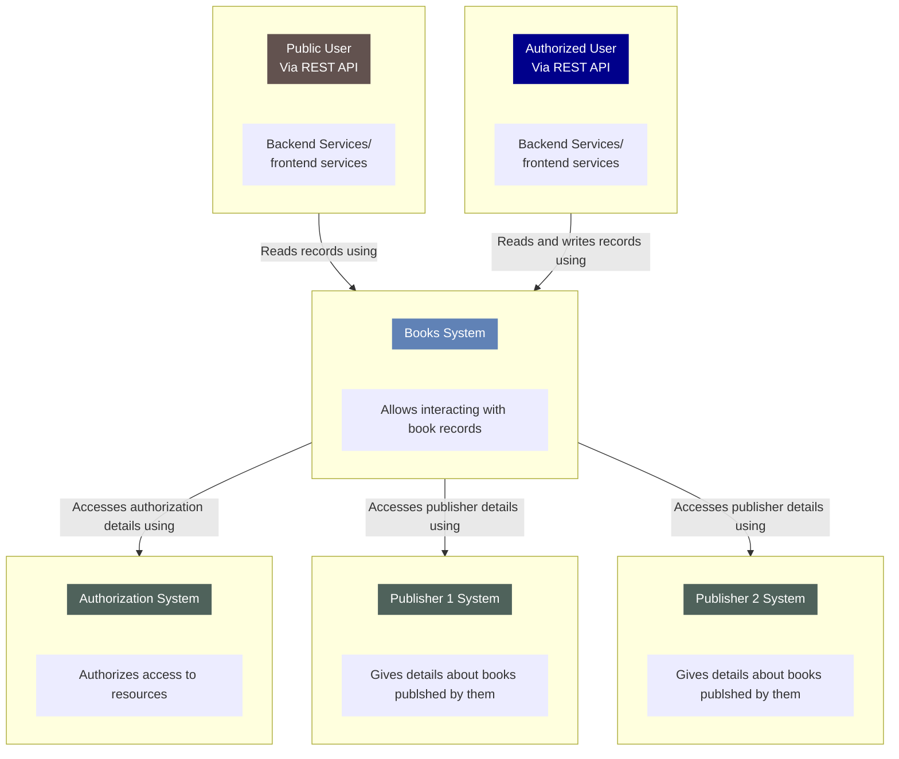
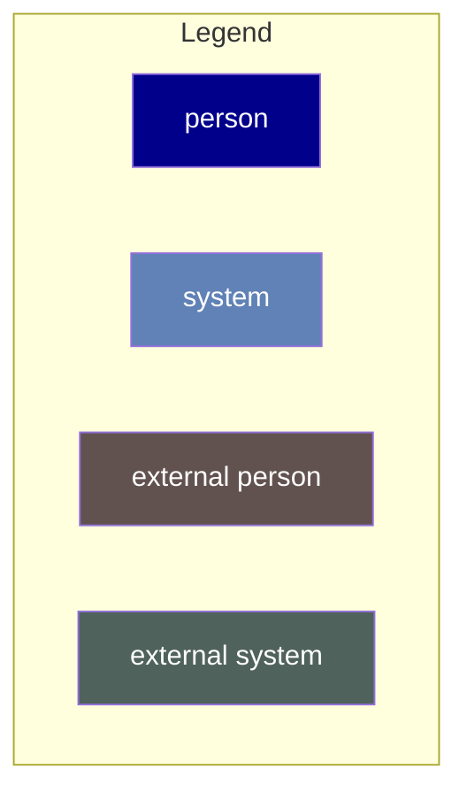

# Book Store System

## Context Diagram for Book Store System

```mermaid
flowchart TB
classDef borderless stroke-width:0px
classDef darkBlue fill:#00008B, color:#fff
classDef brightBlue fill:#6082B6, color:#fff
classDef gray fill:#62524F, color:#fff
classDef gray2 fill:#4F625B, color:#fff

subgraph publicUser[ ]
    A1[[Public User<br/> Via REST API]]
    B1[Backend Services/<br/>frontend services]
end
class publicUser,A1 gray

subgraph authorizedUser[ ]
    A2[[Authorized User<br/> Via REST API]]
    B2[Backend Services/<br/>frontend services]
end
class authorizedUser,A2 darkBlue

subgraph booksSystem[ ]
    A3[[Books System]]
    B3[Allows interacting with book records]
end
class booksSystem,A3 brightBlue


publicUser--Reads records using-->booksSystem
authorizedUser--Reads and writes records using-->booksSystem

subgraph authorizationSystem[ ]
    A4[[Authorization System]]
    B4[Authorizes access to resources]
end

subgraph publisher1System[ ]
    A5[[Publisher 1 System]]
    B5[Gives details about books publshed by them]
end
subgraph publisher2System[ ]
    A6[[Publisher 2 System]]
    B6[Gives details about books publshed by them]
end
class authorizationSystem,A4,publisher1System,A5,publisher2System,A6 gray2

booksSystem--Accesses authorization details using-->authorizationSystem
booksSystem--Accesses publisher details using-->publisher1System
booksSystem--Accesses publisher details using-->publisher2System

class A1,A2,A3,A4,A5,A6,B1,B2,B3,B4,B5,B6 borderless

click A3 "/csymapp/mermaid-c4-model/blob/master/containerDiagram.md" "booksSystem"
```

```mermaid
flowchart TB
classDef borderless stroke-width:0px
classDef darkBlue fill:#00008B, color:#fff
classDef brightBlue fill:#6082B6, color:#fff
classDef gray fill:#62524F, color:#fff
classDef gray2 fill:#4F625B, color:#fff

subgraph Legend[Legend]
    Legend1[person]
    Legend2[system]
    Legend3[external person]
    Legend4[external system]
end
class Legend1 darkBlue
class Legend2 brightBlue
class Legend3 gray
class Legend4 gray2
```