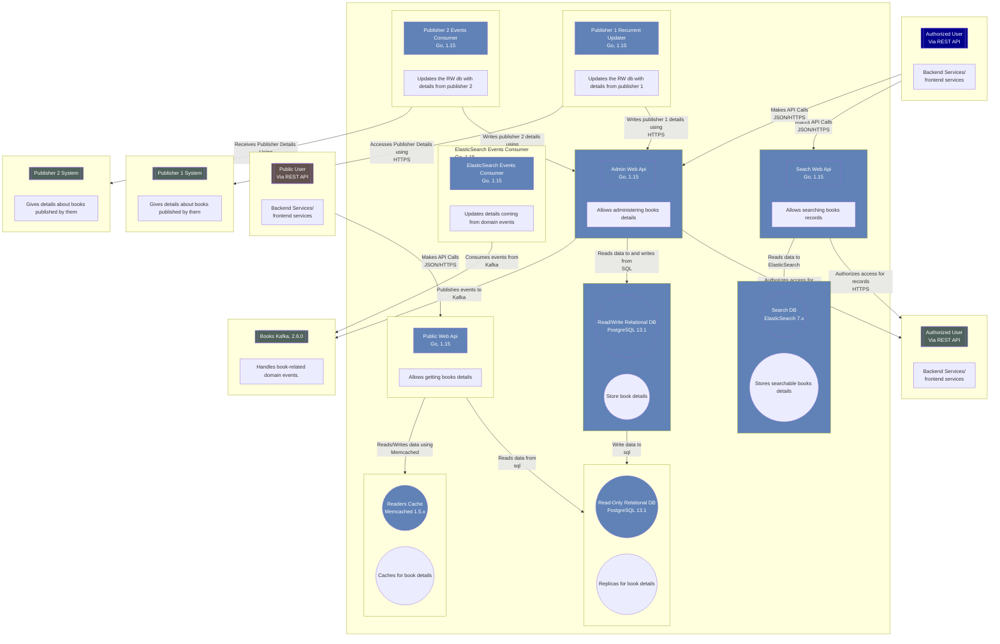
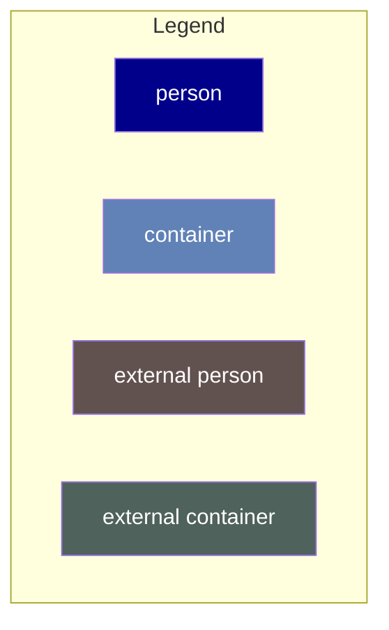

## Container Diagram

```mermaid
flowchart TB
classDef borderless stroke-width:0px
classDef darkBlue fill:#00008B, color:#fff
classDef brightBlue fill:#6082B6, color:#fff
classDef gray fill:#62524F, color:#fff
classDef gray2 fill:#4F625B, color:#fff

subgraph authorizedUser[ ]
    A0[[Authorized User<br/> Via REST API]]
    B0[Backend Services/<br/>frontend services]
end
class authorizedUser,A0 darkBlue

subgraph authorizationSystem[ ]
    A1[[Authorized User<br/> Via REST API]]
    B1[Backend Services/<br/>frontend services]
end
class authorizationSystem,A1 gray2

authorizedUser--Makes API Calls<br/>JSON/HTTPS-->SWA
authorizedUser--Makes API Calls<br/>JSON/HTTPS-->AWA
SWA--Authorizes access for records<br/>HTTPS-->authorizationSystem
AWA--Authorizes access for records<br/>HTTPS-->authorizationSystem

subgraph booksSystem[ ]
    subgraph SWA[ ]
        A2[Seach Web Api<br/>Go, 1.15]
        B2[Allows searching books records]

    end
    class SWA,A2 brightBlue
    SWA--Reads data to<br/>ElasticSearch-->SDB
    subgraph AWA[ ]
        A3[Admin Web Api<br/>Go, 1.15]
        B3[Allows administering books details]
    end
    class PWA,A10 brightBlue
    AWA--Reads data to and writes from<br/>SQL-->RDB
    subgraph EEC[ElasticSearch Events Consumer<br/>Go, 1.15]
        A4[ElasticSearch Events Consumer<br/>Go, 1.15]
        B4[Updates details coming from domain events]

    end
    class EEC,A4 brightBlue
    subgraph RDB[ ]
        A5((Read/Write Relational DB<br/>PostgreSQL 13.1))
        B5((Store book details))
    end
    class RDB,A5 brightBlue
    subgraph SDB[ ]
        A6((Search DB<br/>ElasticSearch 7.x))
        B6((Stores searchable books details))
    end
    class SDB,A6 brightBlue
    subgraph P1U[ ]
        A7[Publisher 1 Recurrent Updater<br/>Go, 1.15]
        B7[Updates the RW db with details from publisher 1]
    end
    class P1U,A7 brightBlue
    P1U--Writes publisher 1 details using<br/>HTTPS-->AWA
    subgraph P2E[ ]
        A8[Publisher 2 Events Consumer<br/>Go, 1.15]
        B8[Updates the RW db with details from publisher 2]
    end
    class P2E,A8 brightBlue
    P2E--Writes publisher 2 details using<br/>HTTPS-->AWA
    subgraph RDBO[ ]
        A9((Read-Only Relational DB<br/>PostgreSQL 13.1))
        B9((Replicas for book details))
    end
    class RDBO,A9 brightBlue
    RDB--Write data to<br/>sql-->RDBO
    subgraph PWA[ ]
        A10[Public Web Api<br/>Go, 1.15]
        B10[Allows getting books details]
    end
    class AWA,A3 brightBlue
    class PWA,A10 brightBlue
    PWA--Reads data from<br/>sql-->RDBO
    subgraph RC[ ]
        A11((Readers Cache<br/>Memcached 1.5.x))
        B11((Caches for book details))
    end
    class RC,A11 brightBlue
    PWA--Reads/Writes data using<br/>Memcached-->RC
    
end
subgraph publicUser[ ]
    A12[[Public User<br/> Via REST API]]
    B12[Backend Services/<br/>frontend services]
end
class publicUser,A12 gray
publicUser--Makes API Calls<br/>JSON/HTTPS-->PWA

subgraph p1S[ ]
    A13[[Publisher 1 System]]
    B13[Gives details about books published by them]
end
class p1S,A13 gray2
subgraph p2S[ ]
    A14[[Publisher 2 System]]
    B14[Gives details about books published by them]
end
class p2S,A14 gray2
P1U--Accesses Publisher Details using<br/>HTTPS-->p1S
P2E--Receives Publisher Details Using<br/>Kafka-->p2S
subgraph bKafka[ ]
    A15[[Books Kafka, 2.6.0]]
    B15[Handles book-related domain events.]
end
class bKafka,A15 gray2
EEC--Consumes events from<br/>Kafka-->bKafka
AWA--Publishes events to<br/>Kafka-->bKafka

click A3 "/csymapp/mermaid-c4-model/blob/master/AWAComponent.md" "AWA"
```

```mermaid
flowchart TB
classDef borderless stroke-width:0px
classDef darkBlue fill:#00008B, color:#fff
classDef brightBlue fill:#6082B6, color:#fff
classDef gray fill:#62524F, color:#fff
classDef gray2 fill:#4F625B, color:#fff

subgraph Legend[Legend]
    Legend1[person]
    Legend2[container]
    Legend3[external person]
    Legend4[external container]
end
class Legend1 darkBlue
class Legend2 brightBlue
class Legend3 gray
class Legend4 gray2
```